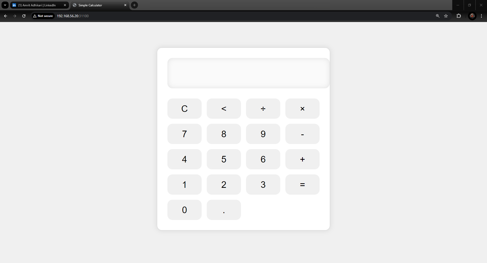

# SimpleCalculator-KubernetesDepoyment

This project provides a lightweight and efficient deployment of a simple calculator web application built with HTML, CSS, and JavaScript. We leverage the power of Docker for containerization and Kubernetes for orchestration, ensuring a scalable and manageable application lifecycle.

This guide outlines the steps for building the Docker image on a separate server and deploying it within a Kubernetes cluster. This separation aligns with best practices, as it keeps your development and build environments dedicated, while Kubernetes focuses solely on managing and running the application.

**Building the Docker Image**

1. Prerequisites:

- Docker: Ensure Docker is installed and running on your local machine.
- Docker Hub Account: Create a Docker Hub account.
- Project Files: Make sure your HTML, CSS, and JavaScript files are organized in the appropriate directories 
   To get started, clone this project using Git: https://github.com/Ad-Amrit/SimpleCalculator-KubernetesDepoyment.git

2. Build:

- Open a terminal or command prompt and navigate to the project's root directory.
- Run the following command to build the Docker image:
- docker build -t <your-username>/simple-calculator . (example: docker build -t adamrit/simple-calculator .)
   Replace <your-username> with your Docker Hub username

**Pushing the Docker Image**

1. Login:

- To push the image to Docker Hub, log in with your Docker Hub credentials:
   docker login

2. Tag Image:

- Tag the image with your desired username and repository name:
   docker tag simple-calculator <your-username>/simple-calculator:latest

3. Push Image:

- Push the image to Docker Hub:
   docker push <your-username>/simple-calculator:latest

**Deploying the Application using Kubernetes**

1. Prerequisites:

- A Kubernetes cluster configured and accessible.
- kubectl command-line tool installed and configured to interact with your cluster.

2. Create Kubernetes Manifests:

- Create YAML files to define the deployment and service for your application:
   deployment.yaml: This file defines how replicas of your application should be deployed and managed.
   service.yaml: This file exposes your application running in pods as a service that other components can access.

(Note: You can write deployment and service in same yaml file)

3. Apply Manifests:

- Apply the YAML files to your Kubernetes cluster using the kubectl apply command:
   kubectl apply -f simple-calculator.yaml

4. Access the Application:

- Retrieve the service's external IP or internal cluster IP using `kubectl get service`
   To check from the command line, type `curl <Internal-IP'>` (e.g: curl 10.110.11.22)

- Access the calculator at http://<IP_address>:<port>. 
   (e.g: 192.168.56.20:31100)

   